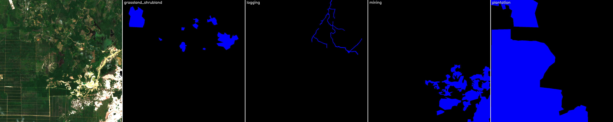
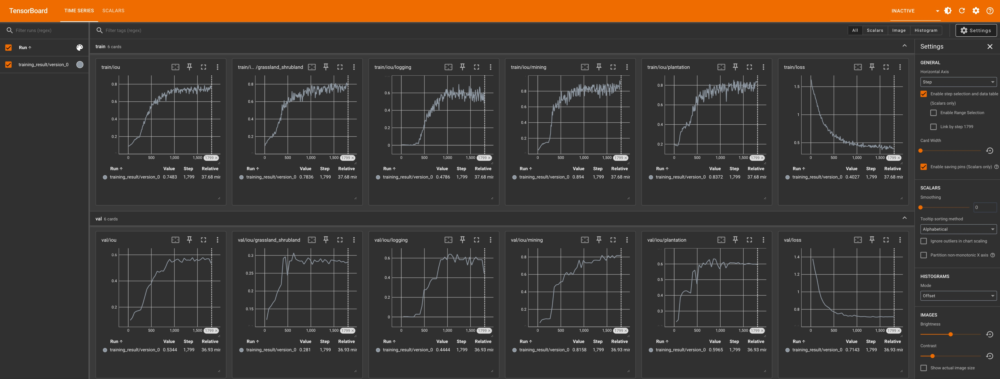

# solafune_deforestation_baseline

This repository provides a baseline solution for the [Identifying Deforestation Drivers competition by Solafune](https://solafune.com/competitions/68ad4759-4686-4bb3-94b8-7063f755b43d?menu=about&tab=overview).

**By running the provided notebooks, you will achieve a score of around 0.533 on the public leaderboard.**

> cf. @solafune (https://solafune.com) Use for any purpose other than participation in the competition or commercial use is prohibited. If you would like to use them for any of the above purposes, please contact us.

## Requirements

### Datasets

Download the datasets and organize them as follows:

```
data/
├── evaluation_images/
│   ├── evaluation_0.tif
│   ├── evaluation_1.tif
│   ├── evaluation_2.tif
│   ├── ...
├── train_images/
│   ├── train_0.tif
│   ├── train_1.tif
│   ├── train_2.tif
│   ├── ...
├── train_annotations.json
```

### Libraries

Please install the python packages imported the first cell of the notebooks.

## Usage

### Step-1: generate segmentation masks for training

[generate_masks.ipynb](generate_masks.ipynb) generates segmentation masks for the training images and save them as `.npy` files.
These files will be used as training labels (see the section below).

Each `.npy` file contains a numpy array of shape (4, 1024, 1024) for the four classes (`grassland_shrubland`, `logging`, `mining`, and `plantation`).
The pixels with value 255 are considered to be the corresponding class.

```
data/
├── train_masks/
│   ├── train_0.npy
│   ├── train_1.npy
│   ├── train_2.npy
│   ├── ...
```

The notebook also saves the visualization of the masks along with the RGB image as a png file.
These files are just for visualization (not used for training).

```
data/
├── vis_train/
│   ├── train_0.png
│   ├── train_1.png
│   ├── train_2.png
│   ├── ...
```

Below is a visualization example for `train_39.tif`.



### Step-2: train U-Net and generate the submission file for the evaluation images

[train_model.ipynb](train_model.ipynb) trains a U-Net model for 4-class segmentation (`grassland_shrubland`, `logging`, `mining`, and `plantation`) and generates a submission JSON file for the evaluation images from the output from the U-Net model.

The submission JSON file is saved to `data/submission.json`.

Before running this notebook, you have to run [generate_masks.ipynb](generate_masks.ipynb) to generate `.npy` files which will be used for training.


